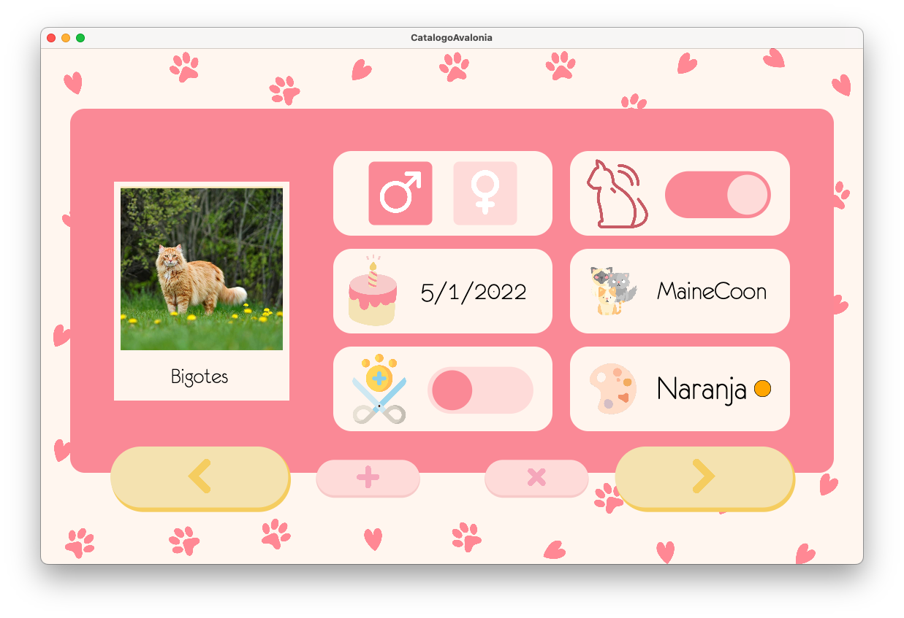

# 🐱 Catálogo Veterinario: Desktop App con Avalonia UI

Aplicación de escritorio multiplataforma desarrollada en C# y **Avalonia UI** para la gestión y registro de felinos en clínicas veterinarias o refugios. 

El proyecto destaca por una interfaz gráfica altamente personalizada y amigable, construida siguiendo estrictamente el patrón de arquitectura **MVVM (Model-View-ViewModel)** para garantizar la separación de conceptos y la escalabilidad del código.

## 🛠️ Stack Tecnológico

* **Lenguaje:** C# (.NET)
* **Framework UI:** Avalonia UI (XAML)
* **Arquitectura:** MVVM (implementado con `CommunityToolkit.Mvvm`)
* **Persistencia:** Archivos locales en formato JSON (`System.Text.Json`)

## ✨ Funcionalidades Principales

* **Gestión de Registros (CRUD):** Creación, visualización, edición y eliminación de perfiles de gatos.
* **Persistencia de Datos:** Autoguardado y carga dinámica del catálogo completo en formato `.json`, incluyendo la serialización de las imágenes en base64 (Byte Arrays).
* **Manejo de Archivos Locales:** Integración de `OpenFileDialog` para cargar fotografías desde el explorador de archivos del sistema.
* **Interfaz Dinámica (Data Binding):** Navegación fluida entre perfiles mediante comandos reactivos (`RelayCommand`) y propiedades observables (`ObservableProperty`).
* **Estilos XAML Personalizados:** Sobrescritura de `ControlTemplates` para adaptar componentes nativos (como `ToggleSwitch`, `CalendarDatePicker` y `ComboBox`) al diseño UI/UX del sistema.

## 📸 Interfaz de Usuario (UI/UX)

La aplicación cuenta con un diseño intuitivo, paleta de colores personalizada mediante `DynamicResource` y validación de formularios mediante cuadros de diálogo modales adaptados.



## 📂 Estructura del Código

* `/View:` Contiene el archivo `MainView.axaml` con la definición de la interfaz gráfica y los estilos customizados.
* `/ViewModel:` Contiene `MainViewModel.cs`, la capa de lógica reactiva que conecta los datos con la vista mediante bindings.
* `/Model:` Definición de las clases entidad (Gato, Razas, Colores).
* `/Datos:` Directorio autogenerado para el almacenamiento seguro del archivo `gatos.json`.

---

## 📋 Requisitos Previos

Para compilar y ejecutar este proyecto en tu entorno local, necesitas:
* **[.NET SDK](https://dotnet.microsoft.com/download)** (Versión 7.0 u 8.0 recomendada).
* Un IDE compatible con desarrollo en C# y XAML (Visual Studio 2022, JetBrains Rider o Visual Studio Code con la extensión de C#/Avalonia).

## 🚀 Instalación y Ejecución

1. Clona este repositorio en tu máquina local:
   ```bash
   git clone https://github.com/paulaschez/avalonia-cat-catalog.git
    ```

2. Navega al directorio raíz del proyecto:
```bash
   cd avalonia-cat-catalog
```

3. Restaura las dependencias y paquetes NuGet:
```bash
   dotnet restore
```

4. Compila y ejecuta la aplicación:
```bash
   dotnet run
```
---
**Autora:** Paula Sánchez Vélez · [@paulaschez](https://github.com/paulaschez)
